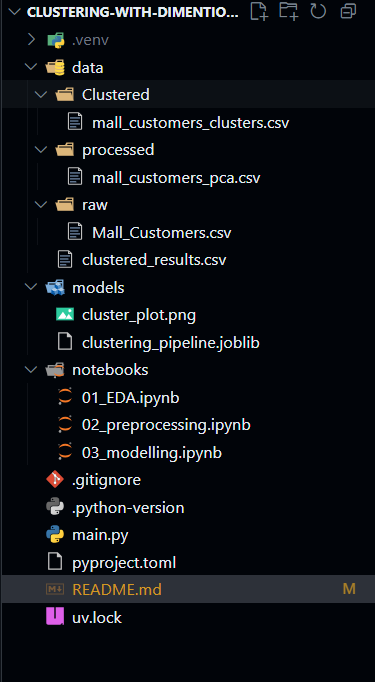

# End-to-End Customer Segmentation

This project is a complete, end-to-end machine learning pipeline that performs customer segmentation on the "Mall Customers" dataset. It uses `PCA` for dimensionality reduction and `KMeans` for clustering to identify distinct customer groups.

The entire process, from preprocessing to clustering, is bundled into a single `scikit-learn` `Pipeline`, making it reproducible and ready for production.

---

## 🚀 Key Features

* **Preprocessing:** Automatically applies `StandardScaler` to numerical features (`Age`, `Annual Income`, `Spending Score`) and `OneHotEncoder` to categorical features (`Gender`).
* **Pipeline:** Uses `ColumnTransformer` and `Pipeline` to create a single, clean workflow.
* **Dimensionality Reduction:** Uses Principal Component Analysis (PCA) to reduce the feature space for better cluster visualization and performance.
* **Clustering:** Applies the K-Means algorithm to segment customers into distinct groups.
* **Reproducibility:** Saves the final clustered data, the trained pipeline model, and a visualization of the results.

---

## 🛠 Tech Stack

* Python
* pandas
* scikit-learn
* joblib
* matplotlib
* seaborn

---

## 📂 Project Structure

Your project directory should look like this:
